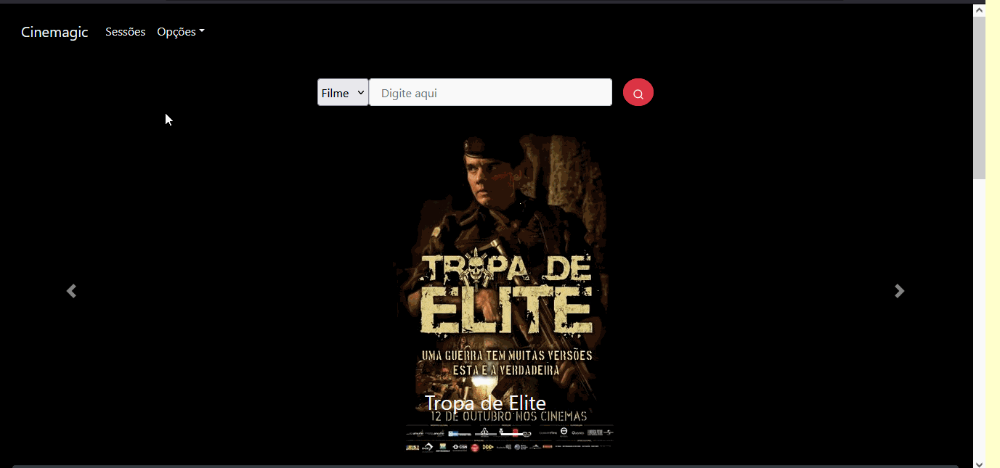

# Cinemagic React App

Front-end desenvolvido em React JS para a disciplina de Resolução de Problemas IV do curso de Engenharia de Software, disponível em: [Cinemagic Vercel](https://cinemagic-web-source-thalisantunesdasilva.vercel.app).

## Inicializando projeto

Em seu diretório execute:

### `yarn`

E depois

### `yarn start`

A aplicação será aberta em:
[http://localhost:3000](http://localhost:3000) no seu navegador.

